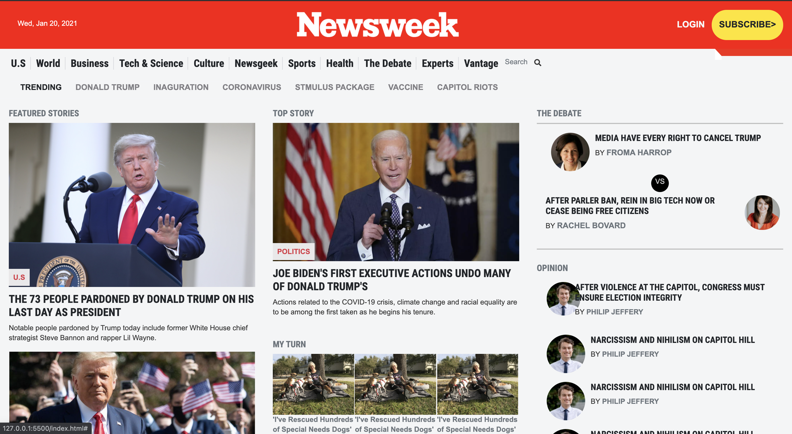

# Newsweek clone (Bootstrap)

> The project is a clone of the newsweek [website](https://web.archive.org/web/20210120125445/https://www.newsweek.com/).



# Built With:

- HTML
- CSS

# Framework:

-Bootstrap 5

## Live Demo
[Live Demo Link](https://uzairali19.github.io/newsweek/)

# Getting Started:

To get a local copy up and running follow these simple example steps.

### Prerequisites

Git
Node, Node package Manager

### Setup Local

Use 

```
git clone https://github.com/uzairali19/newsweek.git
```

to clone the branch directly to your machine

For Linters:

```
npm install --save-dev hint@6.0.x
```

```
npm install --save-dev stylelint@13.3.x stylelint-scss@3.17.x stylelint-config-standard@20.0.x stylelint-csstree-validator
```

### Usage

This is used for learning purposes. Feel free to collaborate.

### Run tests

To locally run tests using html and css linters.

Use:

For HTML:

```
npx hint .
```

For CSS:

```
npx stylelint "**/*.{css,scss}" 
```

### Deployment

Make a pull request if your want to contribute. Thanks.

# Authors:

👤 **Uzair Ali**

- GitHub: [@githubhandle](https://github.com/uzairali19)
- Twitter: [@twitterhandle](https://twitter.com/MahbubA10454419)
- LinkedIn: [LinkedIn](https://www.linkedin.com/in/uzair-ali-964187166/)


👤 **Mahbub Alam**

- GitHub: [@githubhandle](https://github.com/mahbubul14/)
- Twitter: [@twitterhandle](https://twitter.com/MahbubA10454419)
- LinkedIn: [LinkedIn](https://www.linkedin.com/in/mahbubul-alam-20595/)

## 🤝 Contributing

Contributions, issues, and feature requests are welcome!

# Show your support

Give a ⭐️ if you like this project!
